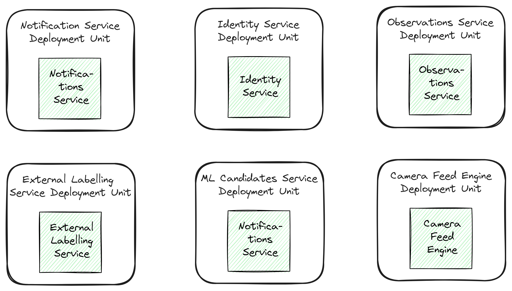
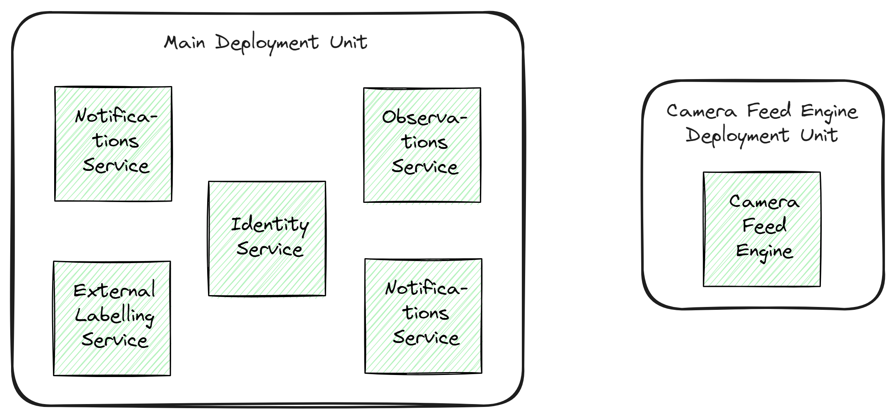

# Wildlife Watcher System
This repository is an implementation of the 2023 O'Reilly Architectural Kata.

Team:
- Ruslan Kachmar
- Stanislav Cheban
- Dmytro Shcherbak

Brief:

Wildlife.ai, a charity using AI to accelerate wildlife conservation, wants to build an open-source wildlife camera that gets triggered based on the movement of target animals, identifies the species on the device, and reports the observation in near real-time to biologists, enabling more efficient species conservation efforts worldwide.

## Glossary
1. **Camera** - a Wildlife.ai device that records animals and uses AI to identify them.
2. **AI Model** - a result of Machine Learning (ML) using services like TensorFlow, Roboflow, etc.
3. **User** - biologists and nature enthusiasts.
4. **Admin** - a user with extended permissions to camera management (like configuring camera settings, and uploading AI model/firmware).
5. **Observation** - an event produced by the Camera of the captured movement.
6. **Training Sample** - a video and(or) photo labeled and selected by Admin for ML.

## Functional requirements
### Short-term
  #### Camera:
  - The camera should be capable of capturing images or videos of animals.
  - The camera should be able to send a small event message with a photo of observed species.
  - The camera should be able to send a heartbeat.

  #### Users:
  - Users should be able to create accounts and log in securely.
  - Allow users to configure camera settings.
  - Allow users to publish frames of observation to third-party services for experts to help with
    the identification of the species (for example, iNaturalist).
  - Allow users to train AI models using training samples.
  - Allow users to export an observation event into the Camtrap DP data exchange format.

  #### Platform:
  - Support integrations with common camera trap labeling platforms
    (Wildlife Insights, TrapTagger, or Trapper)
  - Focus on the scale of dozens of cameras and hundreds of users.
  - Consider open-source software and tools to minimize licensing costs.
  - Design the system to handle a potential increase in users and data as the user base grows.

### Mid-term
  ### Camera:
  - The camera should be able to send metrics (e.g. SD card available space, network speed, battery charge level).
  
  #### Platform:
  - Store user-captured images and videos securely.
  - Integrate with mapping services to show the location of identified animals.
  - Provide information on animal habitats.
  - Store identification results locally (on the camera) and synchronize when online.
  - Store and analyze metric events.

### Long-term
  #### Platform:
  - Implement a community forum or social features to connect enthusiasts.

## Architecture Characteristics
Considering the requirements, the following architecture characteristics are identified:

### Availability
The core functionality of the system is notifying observations in near real-time to biologists, which means that the system should be highly available. The maximum acceptable downtime is X hours per year.

### Responsiveness
The system should be responsive to Cameras' observations. The system should be able to process observations in near real-time. The maximum acceptable delay is X seconds.

### Elasticity
Based on the fact that the cameras track the movements of animals and insects, the number of observations changes based on the time of the day and/or season and tons of other natural causes. In addition, the number of cameras is increasing over time. Considering it, the system should be able to scale up and down automatically.

### Performance
The firmware of the camera should be able to process/analyze the video stream in real-time. The camera is built with a combination of ultra-low-power microcontrollers, which means that the processing should be well-optimized in terms of its efficiency, speed, and resource utilization.

### Reliability
To be able to notify observations in near real-time, the system should be reliable. Meaning that the system should be able to recover from failures and continue to operate without interruption. 

### Security
The communication between a camera and the system should be secure. The system should be able to authenticate the camera, and the camera should be able to authenticate the system (model and firmware should be signed). The access to the cameras should be restricted to the specific users, as well as the access to observations.

## Architecture

In our pursuit of creating a highly adaptable and flexible software architecture, we've designed a system consisting of six core microservices. Each of these microservices is independently deployable and capable of functioning in isolation. This architecture allows us to seamlessly adapt to changing requirements while maintaining a robust and interconnected system.

### Identity Service

The Identity Service is responsible for managing user identity and authentication. Its primary purpose is to establish a secure and centralized authentication mechanism. Additionally, the service manages user access to cameras.

**External Dependencies**: None

**Message Handling**:
- Camera Registration Messages: The service handles camera registration messages, which provide camera information. Administrators use this information to grant users access to specific cameras.

**Message Generation**:
- New User Registration Message: The Identity Service generates a message when a new user is registered.

### Observations Service

The Observations Service is responsible for storing observations and orchestrating the work (sending for labeling, training AI model, or notifications) on those observations.

**External Dependencies**: None

**Message Handling**:
- New Observation Captured: All new observations are stored in the service's database.
- Unrecognized Species Labeled: The service handles this message (reply) to maintain a labeling history for all observations and make labeled observations available for use in AI model training.

**Message Generation**:
- New Observation Captured or Changed (Labelled): The service generates a message when a new observation is tracked or when changes to existing ones are made (such as labeling), ensuring that relevant updates are handled by other services (e.g. ENS).
- Command to Label Unrecognized Species: An outbound message (command) is produced when there's a need to label an unrecognized species using an external service (triggered by the user or system).
- Command to Generate a New AI Model: The service generates a message (command) when new training samples are ready for constructing a new AI model.

### Notifications Service

The Notifications Service is dedicated to delivering real-time push notifications to mobile clients, with a primary focus on providing updates on observations that users are subscribed to.

**External Dependencies**: Notification message delivery service

**Message Handling**:
- New Camera Added: Stores camera info locally to allow authorized users to subscribe for notifications from that camera.
- New Users: Stores user info locally to manage subscriptions between users/cameras.
- Observations Captured: Sends notifications on the captured observation to all subscribed users.

**Message Generation**: None

### External Labeling Service

The External Labeling Service communicates with external labeling services, such as Wildlife Insights, TrapTagger, or Trapper.

**External Dependencies**: Wildlife Insights, TrapTagger, or/and Trapper

**Message Handling**:
- Unrecognized Species to be Labeled Message (command): The service handles these messages and tries to get a label for the species from messages that require identification.

**Message Generation**:
- Labeled species: When the service successfully labels a species, it generates a message (reply) with labeled species information.

### ML Candidates Service

The ML Candidates Service is responsible for communication with external AI model training services, such as Roboflow, Edge Impulse, or TensorFlow Lite.

**External Dependencies**: Roboflow, Edge Impulse, or/and TensorFlow Lite

**Message Handling**:
- New Training Samples are Ready: The service manages and generates new AI models based on new training samples.

**Message Generation**:
- New Trained AI Model: When the service successfully completes the training of a new AI model that can be uploaded to cameras.

### Camera Feed Engine

The Camera Feed Engine is a specialized service responsible for direct communication with cameras.

**External Dependencies**: Cameras

**Message Handling**:
- New Model is Generated: Makes a new version of the AI model available to be uploaded to cameras by authorized users.

**Message Generation**:
- New Observation Captured: When a new observation is fully loaded from the camera, it can be processed by other services.
- New Camera Registered: When a new camera is registered in the service and can be used for notifications/configuration, etc.

## Deployment/Development

The architecture lets us scale, maintain, and evolve individual services with ease. However, our approach goes beyond the conventional microservices model.

    

Based on the requirements (the small number of end users) five of our six microservices (excluding the Camera Feed Engine) can be developed and deployed as a cohesive monolith, without compromising the flexibility and scalability inherent in microservices. These services continue to communicate seamlessly through messaging, making it possible to extract and deploy them individually when the need arises e.g. ENS might be extracted due to load increase.

    

The Camera Feed Engine represents a critical service within our architecture. It is designed to operate independently and is optimized for dynamic scaling based on various factors, such as the number of cameras available and the rates of messages delivered from cameras. This design ensures that this service can efficiently handle varying workloads while remaining separate from the monolithic setup.

## Sequence diagrams 
1. Camera success (camera identifies the species)
2. 3rd party success (camera doesn't identify species, user initiates 3rd party recognition)
3. iNaturalist success
4. Admin initiates training
5. ?Admin configure camera?

## ADRs
- [Monolith/Microservices](ADRs/3010-monolith-microservices.md)
- [Sending a picture of captured species](ADRs/3010-sending-picture-of-captured-species.md)
- [Services Communication Pattern](ADRs/3010-services-communication.md)
- [Mobile Apps Framework](ADRs/2910-mobile-apps-framework.md)
- [Mobile Video/Image Processing](ADRs/2910-mobile-video-image-processing.md)
- [Access permissions to cameras](ADRs/3010-access-permissions-to-cameras.md)
- [Machine learning process](ADRs/3010-machine-learning.md)
- [Export observations into the camptrap DB exchange format](ADRs/3010-export-observations.md)
